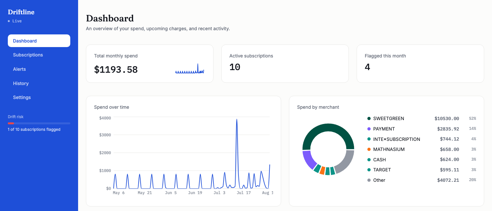

# Driftline

https://drifitline.vercel.app

Connect a bank account and Driftline finds every recurring subscription hiding in your transaction history — even the ones you forgot about — then tells you the moment one changes price.

Live demo: _coming soon_

## What it does
Driftline ingests real transaction data (via Plaid) and does three things a spreadsheet can't: it groups messy, inconsistently-named recurring charges into one subscription per merchant, forecasts what each subscription should cost next, and flags any charge that deviates from that forecast — in real time, over a live alert feed, not just after the fact.

## Features
- **Unsupervised subscription discovery** — DBSCAN clustering (scikit-learn) groups transactions into subscriptions by amount and billing-interval pattern, with no manual tagging; a merchant only becomes a tracked subscription once it recurs at least 3 times.
- **Fuzzy merchant name normalization** — rapidfuzz-based matching collapses inconsistent merchant strings ("NETFLIX INC", "NETF\*SUBSCRIPTION", "NETFLIX.COM") into one canonical merchant before clustering ever sees them.
- **Statistical drift detection** — every new charge is compared against a Holt-Winters exponential-smoothing forecast of its subscription; anything more than 2 standard deviations off gets flagged, not an arbitrary percentage.
- **Real-time alerts** — a WebSocket pushes newly-flagged charges to the browser the moment the backend's scheduler detects them, no page refresh needed.
- **Full charge history per subscription** — actual vs. forecast amount charted over time, with drift points visually called out.
- **Dedicated Alerts page** — the complete flagged-transaction history, not capped to a dashboard preview.
- **Encrypted credentials at rest** — Plaid access tokens are Fernet-encrypted in the database, never stored in plaintext.
- **Multi-tenant by design** — every query is scoped to the authenticated user's own linked accounts; there is no code path that can read another user's data.
- **Rate-limited, JWT-authenticated API** — auth and account-linking endpoints are protected against abuse.

## Tech stack
**Frontend:** React, TypeScript, Vite, Tailwind CSS, React Router, Recharts

**Backend:** FastAPI, SQLAlchemy 2.0 (async), PostgreSQL, Alembic, APScheduler

**ML / Stats:** scikit-learn (DBSCAN clustering), statsmodels (Holt-Winters exponential smoothing), rapidfuzz (merchant name matching), z-score anomaly detection

**Data source:** Plaid API (Transactions, sandbox environment)

**Testing:** pytest (44 backend tests covering clustering, forecasting, drift scoring, auth, and WebSocket authentication)

**Deployed on:** Vercel (frontend), Render (backend), Neon (database)

## Architecture
A scheduled job runs every 20 seconds per linked account: it pulls new transactions from Plaid's cursor-based sync API, clusters unrecognized merchants into subscriptions via DBSCAN, forecasts each subscription's next charge with Holt-Winters smoothing, and z-score-checks the latest charge against that forecast. Any newly-flagged charge is broadcast immediately over a WebSocket to that user's active browser sessions.

The frontend never talks to Plaid directly — only the FastAPI backend does, keeping Plaid credentials server-side and encrypted at rest. Every database query is scoped through the authenticated user's own linked accounts, so tenant isolation is enforced at the query layer, not just the API layer.

## Built by
Nelson Supriyasilp
